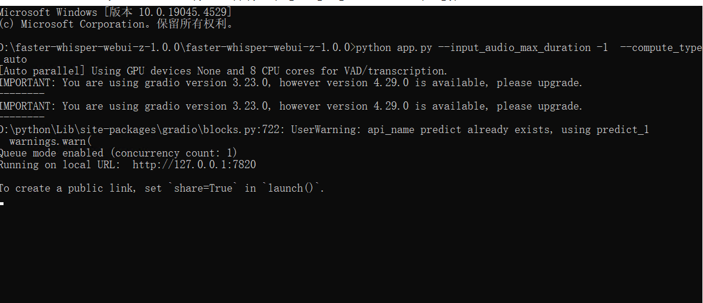
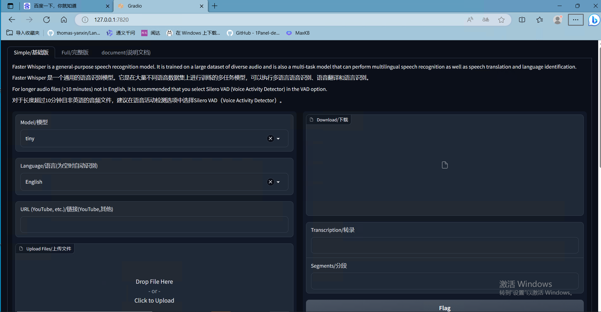
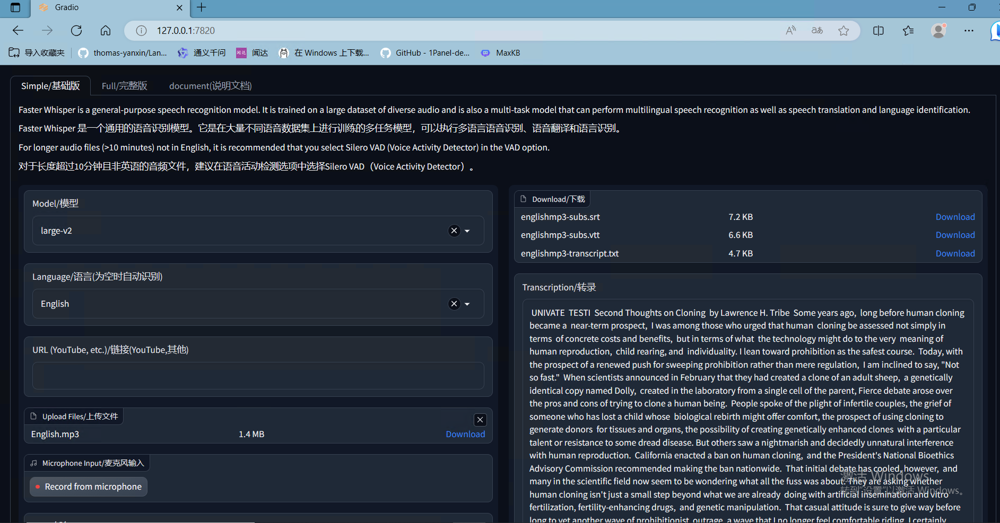

# faster-whisper-webui 本地部署

faster-whisper是基于OpenAI的Whisper模型的高效实现，为了预研大模型语音转文本效果，本地部署faster-whisper，并通过基于gradio的web进行可视化测试效果。

## 第一步 环境安装

1、确定自己电脑显卡对应的CUDA 和cuDNN必须要安装，我的电脑显卡为NVIDIA GeForce RTX 3080 Ti，对应cuda12.1.1和cuDNN v8.9.7。

2、因为后续要用到ffmpeg-python，所以要确保ffmpeg已经安装，不然后续会报错。

## 第二步 克隆本源码并安装依赖

可以在github项目页面直接下载或者用命令：

```python
https://github.com/shanshan-he/faster-whisper-webui.git
```


安装所有依赖项：

```python
pip install -r requirements.txt
```


## 第三步 模型下载

模型下载，并新建一个models的目录，再新建faster-whisper子目录把模型文件放入，以及新建silero-vad子目录安装开源语音活动检测库，格式如下所示：

```
├─faster-whisper
│  ├─base
│  ├─large
│  ├─large-v2
│  ├─medium
│  ├─small
│  └─tiny
└─silero-vad
    ├─examples
    │  ├─cpp
    │  ├─microphone_and_webRTC_integration
    │  └─pyaudio-streaming
    ├─files
    └─__pycache__


```

[faster-whisper](https://huggingface.co/guillaumekln)模型文件下载或者网盘下载：

```
链接：https://pan.baidu.com/s/11WMmuryHesaf9RAxlGteRQ?pwd=edi8 
提取码：edi8
```

[silero-vad](https://github.com/snakers4/silero-vad)下载


##  第四步 运行程序

使用并行CPU/GPU启用运行完整版本（无音频长度限制）的应用程序，使用命令行运行该命令：

```python
python app.py --input_audio_max_duration -1 --server_name 127.0.0.1 --auto_parallel True
```

```python
--input_audio_max_duration：音频文件的最大长度（以秒为单位），或者设置为-1表示无限制。
--share：是否在HuggingFace上分享应用程序。
--server_name：要绑定到的主机或IP。如果为None，则绑定到本地主机。
--server_port：要绑定到的端口。
--queue_concurrency_count：要处理的并发请求的数量。
--default_model_name：默认模型名称。
--default_vad：默认的语音活动检测（VAD）算法。
--vad_initial_prompt_mode：是否在每个VAD段前添加初始提示（prepend_all_segments表示在所有段前添加，prepend_first_segment表示仅在前一段前添加）。
--vad_parallel_devices：用于并行处理的CUDA设备列表。如果为None，则禁用并行处理。
--vad_cpu_cores：用于VAD预处理的CPU核心数。
--vad_process_timeout：进程终止前的秒数。设置为0表示立即关闭进程，设置为None表示无超时。
--auto_parallel：是否使用所有可用的GPU和CPU核心进行处理。使用vad_cpu_cores/vad_parallel_devices指定要使用的CPU核心数/GPU数。
--output_dir：保存输出的目录。
--whisper_implementation：要使用的Whisper实现（"whisper"或"faster-whisper"）。
--compute_type：用于推理的计算类型（"default"、"auto"、"int8"、"int8_float16"、"int16"、"float16"、"float32"）。
```

运行效果：



在本地网页中可打开URL，效果如下：



同时，可以配置文件config.json5，默认设置自己想要的参数，这里设置了默认tiny量级的模型，语音为英语。


您还可以运行 CLI 界面，它类似于 Whisper 自己的 CLI，但也支持以下附加参数：

```python
python cli.py --model large --vad silero-vad --language Japanese "https://www.youtube.com/watch?v=4cICErqqRSM"
```

```python
python cli.py \
[--vad {none,silero-vad,silero-vad-skip-gaps,silero-vad-expand-into-gaps,periodic-vad}] \
[--vad_merge_window VAD_MERGE_WINDOW] \
[--vad_max_merge_size VAD_MAX_MERGE_SIZE] \
[--vad_padding VAD_PADDING] \
[--vad_prompt_window VAD_PROMPT_WINDOW]
[--vad_cpu_cores NUMBER_OF_CORES]
[--vad_parallel_devices COMMA_DELIMITED_DEVICES]
[--auto_parallel BOOLEAN]
```


## 快速部署

在确保所需第一步环境安装完成，以及models文件齐全后，可直接点击项目中`window.bat` 启动程序，免安装程序。


## 音频转文本效果展示



如果你没有足够强大的GPU来运行大型模型，你还可以直接在[Google Colab](https://colab.research.google.com/drive/1qeTSvi7Bt_5RMm88ipW4fkcsMOKlDDss?usp=sharing)上运行这个Web UI。


感谢参考资源：[资源1](https://github.com/ycyy/faster-whisper-webui?tab=readme-ov-file)、[资源2](https://blog.csdn.net/qq_51654202/article/details/135417754?spm=1001.2014.3001.5506)、[资源3](https://www.bilibili.com/video/BV1bG411C7LM/?spm_id_from=333.999.0.0&vd_source=fb1c54b41a032e91f9ea072fc9581b62)
